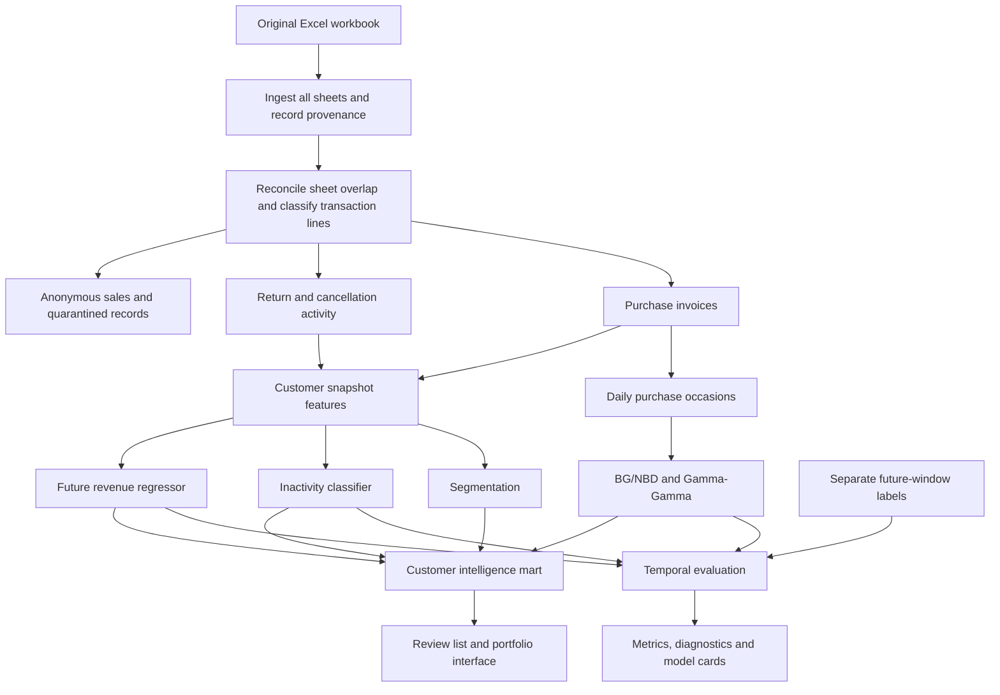

# Customer Value & Retention Intelligence — proposed system design

Research date: 1 October 2026. Status: design proposal supported by a full workbook audit; no predictive models have been trained.

## Recommended direction

Keep the supplied Online Retail II dataset. Build a reproducible batch analytics system that answers three connected questions: what kinds of customers exist, how much revenue they are likely to generate, and which customers are likely to make no purchase in the next 90 days. Combine the outputs into a transparent retention review list and a scenario planner.

The principal portfolio contribution should be the comparison between probabilistic and supervised value models under honest time-based evaluation. The segmentation provides context for that comparison and the retention decision. RFM remains an exploratory baseline.

The workbook supports this scope, subject to careful cleaning and restrained claims. It does not contain profit margins, campaign assignment, offer costs, website activity, or a recorded permanent-churn event. Consequently, label the value output **predicted future revenue**, the risk output **90-day inactivity probability**, and any campaign return **a scenario based on stated assumptions**. See [the dataset assessment](DATASET_ASSESSMENT.md) for measured evidence.

## Scope mapped to the brief

| Brief requirement | Proposed implementation | Evidence required before completion |
| --- | --- | --- |
| Customer analytical dataset | Customer × snapshot feature table, with invoice and daily purchase tables underneath | Feature dictionary, aggregation reconciliation, no future records in features |
| StandardScaler → PCA → K-Means | Log transforms, imputation, StandardScaler, PCA, K-Means; compare a version without PCA | Cluster stability, profile tables in original units, interpretation of each group |
| BG/NBD + Gamma-Gamma | Probabilistic purchase-day counts and positive revenue per purchase day | Assumption diagnostics, finite monetary predictions, out-of-time count and revenue evaluation |
| CatBoost / XGBoost value comparison | Direct future-revenue regression; add a properly specified two-stage 90-day model | Same customers, target, horizon, time unit and test window as the probabilistic model |
| Inactivity / churn | Probability of no qualifying purchase in the following 90 days | Temporal validation, calibration and ranking at a fixed contact capacity |
| Logistic Regression, Random Forest, XGBoost, CatBoost | Run all four as a bounded benchmark; select by validation evidence | Common split and comparable tuning budgets |
| SHAP | Global summaries, dependence plots and a small set of local explanations | Explicit model-output scale and association language |
| Cohort/business analytics | Observed-acquisition cohorts, repeat purchase, return/cancellation activity and value concentration | Mature cohort denominators and partial-period handling |
| GitHub deliverable | Small Python package, SQL, notebooks, tests, configuration and reproducible results | Clean checkout reproduction and an honest README |

## Architecture

Use a local Python package, Parquet files and DuckDB. The problem has about a million source lines but only several thousand identified customers. A single-machine batch workflow is an appropriate starting design; measure runtime and memory before introducing distributed infrastructure. DuckDB can query Parquet and pandas directly. [DuckDB Python API](https://duckdb.org/docs/current/clients/python/overview), [Parquet support](https://www.duckdb.org/docs/current/data/parquet/overview).

### Data contracts

| Table / artifact | Grain / key | Purpose |
| --- | --- | --- |
| `raw_invoice_lines` | Workbook hash, sheet, Excel row number | Immutable import with source column mapping |
| `transaction_lines` | Reconciled source line | Signed revenue and classification flags; preserve questionable records |
| `purchase_orders` | Customer ID × invoice ID | Distinct purchase frequency, basket metrics and positive merchandise sales |
| `purchase_occasions` | Customer ID × source-local calendar date | Consistent daily transaction unit for probabilistic models |
| `customer_snapshots` | Customer ID × cutoff | Features calculated strictly before the cutoff |
| `customer_targets` | Customer ID × cutoff × horizon | Future purchase counts, revenue and inactivity; labels stored separately |
| `customer_scores` | Customer ID × cutoff × model run | Segment, calibrated inactivity, expected revenue and model eligibility flags |
| `evaluation_results` | Model run × fold × population × metric | Comparable model selection and limitations |
| `retention_review_list` | Customer ID × cutoff × policy version | Ranking, action hypothesis and explanation |

Treat IDs as identifiers, not quantities. Preserve original values as strings where appropriate. Prices are in GBP according to UCI. Dates have no timezone information in the file; retain source-local calendar dates rather than converting them to the user's timezone. [UCI dataset documentation](https://archive.ics.uci.edu/dataset/502/online+retail+ii).

Every run should record the workbook hash, feature schema version, configuration hash, model/library versions, cutoff, horizon, eligibility, split definition and random seed. Save scores with the exact feature snapshot and model versions that produced them. Persist fitted scalers, PCA and clustering alongside the models.

## Cleaning and accounting decisions

1. **Load both worksheets.** Map the actual headers (`Invoice`, `Price`, `Customer ID`) to canonical names. Record sheet and row lineage.
2. **Reconcile the overlap first.** The worksheets both cover 1–9 December 2010. Matching records across sheets must contribute once. Use original row values and invoice identity to reconcile line multiplicities; preserve the maximum legitimate multiplicity within one source rather than globally collapsing identical lines. Quarantine conflicting versions. Compare invoice totals before selecting a source-owner rule.
3. **Separate identifiable and anonymous activity.** Anonymous sales can contribute to descriptive store totals. They cannot be assigned invented customer IDs or used as customer training examples. Report identifiable coverage.
4. **Preserve signed events.** Positive merchandise purchases define purchase occurrence. Negative quantities and cancellation-prefixed invoices feed separate credit/return activity. They must never increase purchase frequency. UCI specifies that a `C` prefix means cancellation; the file does not establish that every credit is a physical return. [UCI variable descriptions](https://archive.ics.uci.edu/dataset/502/online+retail+ii).
5. **Classify product and accounting codes explicitly.** Postage, discounts, samples, manual adjustments and bad debt should have named policies. A numeric product-code regex is useful for an audit sensitivity case but excludes legitimate nonstandard merchandise such as some `DCGS` codes and `PADS`. Do not make it the final merchandise definition.
6. **Check extreme orders against credits.** Wholesale-like purchases may be real high-value behavior. Flag them, inspect related events, and report raw and robust evaluation metrics. Fit any clipping thresholds on training data only. Never truncate the actual test revenue to improve a score.
7. **Define revenue consistently.** The primary comparison uses positive merchandise sales, excluding credits and service/accounting lines. Maintain a separate signed transaction revenue view. A return recorded inside a forecast window can refer to an earlier sale; call the resulting signed target period net transaction revenue, rather than margin or perfectly matched order net revenue.
8. **Filter lines before snapshot aggregation.** Some invoices have multiple timestamps. An invoice's minimum timestamp must not pull later line revenue into an earlier feature window. Build historical and future-window totals from lines inside their respective windows, and review invoices spanning a cutoff before defining their order-count policy.

The audit's 776,577 candidate purchase lines and 5,852 customers are a conservative scenario, not final cleaned counts. Its global exact-deduplication and product-code filter deliberately expose sensitivity. The production counts must follow the reconciled policies above.

## Feature and label semantics

Define a cutoff `c` at midnight and a horizon `H` in days:

- Features: only transactions with `invoice_date < c`.
- Labels: transactions with `c <= invoice_date < c + H`.
- Historical eligibility: at least one qualifying purchase before `c`.
- Operational review eligibility: additionally, a qualifying purchase in `[c - 365 days, c)`. Keep the all-history population for a sensitivity comparison.
- New customers whose first purchase occurs after `c` are outside that snapshot's prediction population.
- A target may be zero only when its entire horizon is observed. Otherwise the label is missing/censored.

Primary labels are `returned_90d = 1` when at least one purchase occurs, `inactive_90d = 1 - returned_90d`, and `future_merchandise_revenue_90d`. A cancellation or credit alone does not count as returning. Store positive-class metadata to avoid reporting return-probability metrics as inactivity metrics.

### Feature dictionary

| Feature | Definition at cutoff | Edge-case rule |
| --- | --- | --- |
| `recency_days` | Elapsed days from latest qualifying purchase to cutoff | Source timestamps, nonnegative |
| `frequency_orders` | Distinct qualifying invoices before cutoff | Never count line items as orders |
| `historical_spend_gbp` | Sum of historical positive merchandise revenue | Equals the lifetime-observed sales total |
| `monetary_value_gbp` | Alias for historical spend in the general feature table | Do not duplicate it in clustering or confuse it with Gamma-Gamma input |
| `average_order_value_gbp` | Historical merchandise revenue / purchase orders | Positive-order population |
| `average_basket_size_units` | Purchased units / purchase orders | Also retain distinct SKUs per order to distinguish breadth from bulk |
| `customer_tenure_days` | Cutoff minus first observed qualifying purchase | Observed tenure, not true customer lifetime |
| `purchase_frequency_per_30d` | Orders × 30 / max(observed tenure days, 1) | Flag short-tenure customers and test a minimum exposure rule |
| `average_days_between_orders` | Mean chronological invoice-to-invoice gap | Missing for one-order customers, with a missingness indicator |
| `product_diversity` | Distinct merchandise stock codes purchased | Raw breadth; optionally normalize by order count |
| `return_rate` | Explicit credit-value / purchase-value proxy | Rename to `credit_value_ratio`; can exceed 1 when earlier purchases are outside the window |
| `recent_30d_spend_gbp` | Sales in `[c - 30 days, c)` | Zero when genuinely no purchase |
| `recent_90d_spend_gbp` | Sales in `[c - 90 days, c)` | Same purchase policy as the target |
| `recent_365d_spend_gbp` | Sales in `[c - 365 days, c)` | Useful against observed lifetime-spend bias |
| `orders_30d`, `orders_90d` | Orders in the corresponding prior window | Historical information only |
| `spend_trend` | Recent 30-day spend versus the preceding 60-day monthly average | Use an explicit zero-denominator/missing rule |
| `gap_variability`, `recency_to_gap_ratio` | Variability of historical gaps; recency / typical historical gap | Missing or shrunk for insufficient history |
| `dominant_country`, `is_uk` | Country inferred from historical purchases | Resolve multiple-country customers using a documented history-only rule |
| `one_order_customer`, `short_history` | History-length flags | Used in slice evaluation |
| `snapshot_month` | Known calendar context | Too few seasonal cycles to claim a learned general seasonal pattern |

Do not pass customer ID or invoice ID to the predictive models. Do not learn a product taxonomy or imputation values using future records. Consider a small, explicit feature set before adding many highly correlated ratios.

### Separate probabilistic summary

Daily purchase occasions are the primary probabilistic unit. Same-day invoices are aggregated into one occasion, with their merchandise revenues summed. Consequently, count forecasts mean **purchase days**, and monetary forecasts mean **revenue per purchase day**. Retain invoice count forecasts as a separate supervised endpoint only if clearly labeled.

For each customer, `bgnbd_frequency = number_of_purchase_days - 1`, `bgnbd_recency = last_purchase_day - first_purchase_day`, and `bgnbd_T = cutoff - first_purchase_day`. Gamma-Gamma input is the mean positive revenue of repeat purchase days, excluding the first day. These definitions differ from ordinary RFM recency and historical total spend. All durations must use the same unit. [PyMC-Marketing BG/NBD example](https://www.pymc-marketing.io/en/latest/notebooks/clv/bg_nbd.html).

## Model choices

### Customer segmentation

Implement the brief's pipeline, with skew handling before scaling:

`selected historical behavior features → log1p where appropriate → imputation → StandardScaler → PCA → K-Means`.

Start with recency, order frequency, average order value, basket breadth, purchase rate and diversity. Test removing redundant cumulative-spend measures so lifetime/tenure does not dominate every distance. Compare PCA preserving roughly 85–95% variance with the same standardized feature set without PCA. Those variance levels and `k = 2…8` are initial search choices, not proven optima.

Choose a small interpretable solution using silhouette, Davies–Bouldin, cluster sizes, stability across seeds/resamples, and quantitative business profiles. Silhouette favors dense, separated clusters and is not a complete business criterion. [scikit-learn clustering guide](https://scikit-learn.org/stable/modules/clustering.html).

Report medians and IQRs, customer share, historical revenue share and observed future outcomes. Assign names only after profiles are known. Treat any wholesale-like group as inferred behavior, since the workbook has no business-account flag. GMM is a useful optional soft-membership challenger; HDBSCAN is a stretch diagnostic if the data clearly lack compact clusters.

For backtests, fit segmentation on pre-cutoff data. Never use a full-history segment to select a model for an earlier forecast. Keep segmentation as a separate explanatory layer in the initial supervised models; add cluster labels only as an ablation. Per-segment CLV models require adequate repeat history and a leakage-safe cluster pipeline.

### Inactivity prediction

Run these candidates on identical snapshots:

| Candidate | Role | Initial treatment |
| --- | --- | --- |
| Historical prevalence and recency-only logistic model | Minimum baselines | Establish whether complexity adds value |
| Logistic Regression | Main interpretable baseline | Impute, scale numeric features, encode country; regularize |
| Random Forest | Nonlinear benchmark required by brief | Limit depth and leaf size; assess calibration |
| CatBoost Classifier | Preferred first boosting candidate | Small trees, early stopping on a historical validation window, native country categories |
| XGBoost Classifier | Strong alternative required by brief | Same numeric information and consistent categorical handling |

Following the user's preference to experiment beyond boosting, CatBoost and XGBoost remain benchmarks, while GAM, time-to-next-purchase survival models and compact neural models receive additional attention. See [the model portfolio](MODEL_PORTFOLIO.md) for task-specific candidates, selection criteria and preservation of all runs. No family is a declared winner. CatBoost's documented categorical processing is convenient, although most project features are numeric and country is low cardinality. Ordered processing does not repair future features or invalid temporal splits. [CatBoost categorical feature documentation](https://catboost.ai/docs/en/concepts/algorithm-main-stages_cat-to-numberic).

Use a sigmoid calibrator fitted on a later disjoint calibration snapshot, then freeze that classifier/calibrator for the final test. Compare raw and calibrated reliability, Brier score and log loss. Consider isotonic only if its validation benefit is stable. Brier score measures more than calibration alone, so inspect reliability curves as well. [scikit-learn calibration guide](https://scikit-learn.org/stable/modules/calibration.html).

The provisional labels do not show an extremely rare inactivity class. Begin without SMOTE or automatic class weighting. If weighting improves the contact-capacity objective, still assess calibration on the natural population. Choose contact thresholds and capacity using development/calibration data, never the final test.

### Future revenue / CLV

Use three distinct approaches:

1. **Simple baselines:** recent-window spend, observed spend rate × forecast length, and a shrunk per-customer purchase-rate × occasion-value estimate. Evaluate ranking by past spend as a policy baseline too.
2. **Probabilistic model:** BG/NBD × Gamma-Gamma, with separate evaluation of purchase-day counts and revenue. This follows the brief and tests a behavioral model designed for noncontractual repeat purchasing. [Original BG/NBD paper](https://www.brucehardie.com/papers/018/).
3. **Supervised models:** CatBoost and XGBoost direct revenue regression, with a regularized linear baseline. Try RMSE on GBP and a Tweedie objective for nonnegative targets with many zeros and a long upper tail. Set any target scaling on training data only and restore GBP before scoring. CatBoost documents the nonnegative-label restriction and large-label numerical risks; XGBoost provides `reg:tweedie`. [CatBoost regression objectives](https://catboost.ai/docs/en/concepts/loss-functions-regression), [XGBoost parameters](https://xgboost.readthedocs.io/en/stable/parameter.html).

Add a two-stage 90-day challenger if worthwhile:

`E[revenue_90d | X] = P(returned_90d = 1 | X) × E[revenue_90d | returned_90d = 1, X]`.

Train the conditional spend regressor only on returning customers. If the direct regressor already estimates unconditional revenue using both zero and positive outcomes, use its prediction directly. Multiplying that unconditional estimate by return probability again has no valid expectation interpretation. A log-target model also needs attention to retransformation bias; `expm1` of the predicted mean log revenue does not automatically equal mean GBP revenue.

Prefer **PyMC-Marketing** for the probabilistic implementation. The `lifetimes` repository is archived and identifies PyMC-Marketing as its successor. Use MAP for an initial operational fit and posterior sampling for a reviewed uncertainty analysis if feasible. Do not present MAP point estimates as credible intervals. [lifetimes repository status](https://github.com/CamDavidsonPilon/lifetimes), [PyMC-Marketing CLV quickstart](https://www.pymc-marketing.io/en/latest/notebooks/clv/clv_quickstart.html).

Gamma-Gamma assumes positive spend and independence of individual average spend from the transaction process. Check Pearson/Spearman relationships, plots, time stability and residual patterns; a small correlation is a diagnostic, not proof of independence. Fit only eligible repeat buyers and define an explicit prior/population fallback for one-occasion customers. [Gamma-Gamma model assumptions](https://www.pymc-marketing.io/en/latest/notebooks/clv/gamma_gamma.html).

Check whether the spend distribution implies finite useful expectations: the population mean requires the appropriate Gamma-Gamma shape parameter `q > 1`. Investigate prior sensitivity and heavy-tail fit before using population mean predictions for one-time buyers. A invalid or unstable spend fit is a result to report; compare a shrunk empirical spend model or supervised revenue model rather than masking it with arbitrary parameters. [Hardie's monetary-value derivation](https://www.brucehardie.com/notes/025/gamma_gamma.pdf).

BG/NBD's latent `P(alive)` is a different event from purchasing in the next 90 days. The basic model also gives `P(alive) = 1` for customers with zero repeat purchases under its conventional formulation. Do not use `1 - P(alive)` as the classifier's inactivity probability. Modified BG/NBD is an optional challenger if single-purchase behavior warrants it. [Hardie's probability-alive note](https://www.brucehardie.com/notes/021/palive_for_BGNBD.pdf).

The primary output is 90-day undiscounted merchandise revenue. Also implement the brief's **six-calendar-month revenue** forecast and compare it at earlier cutoffs. The audit includes 180-day feasibility as an additional diagnostic; 180 days and six calendar months are not interchangeable. For exact six-month evaluation, June-to-December and December-to-June windows fit within this workbook. Discounted revenue and assumed-margin value can be scenario outputs with explicit rate and margin inputs. Historical revenue is never presented as future CLV.

## Time-based evaluation

The user-requested LSTM addition is specified in [the sequence-model experiment](SEQUENCE_MODEL_EXPERIMENT.md). Start with a compact weekly-sequence inactivity model and GRU comparison, using the same dates, labels and populations as the tabular benchmarks. Matched-input CatBoost and MLP controls distinguish recurrent architecture from additional weekly information. This is planned work; no neural model results are claimed.

The complete final day is unknown because the last record is on 9 December 2011 at 12:50. Conservatively use data before midnight on 9 December for mature-label checks. September 2011 supports a full 90-day test; it cannot support a full 180-day test.

### Primary 90-day schedule

| Role | Feature cutoff(s) | Outcome end, exclusive | What it controls |
| --- | --- | --- | --- |
| Initial training | 1 Jun, 1 Sep, 1 Dec 2010 | 30 Aug 2010; 30 Nov 2010; 1 Mar 2011 | Initial classifier and revenue fitting |
| Model/hyperparameter selection | 1 Mar 2011 | 30 May 2011 | Family, features, tree complexity and early stopping |
| Calibration / policy development | 1 Jun 2011 | 30 Aug 2011 | Calibrated probabilities and operational thresholds |
| Final out-of-time test | 1 Sep 2011 | 30 Nov 2011 | Frozen model comparison and policy evaluation |

For the final classifier: select on March, refit the base estimator on training plus March examples available by June, calibrate on June, and freeze the estimator/calibrator through September. Fix any iteration count during development before that refit. Do not refit the estimator after calibration without obtaining appropriate new calibration evidence.

BG/NBD and Gamma-Gamma can fit customer histories available at each forecast cutoff because they do not require future labels. Their selected priors, model family and cleaning policies must nevertheless remain fixed before the final test. Make this forecast-origin fitting policy explicit when comparing them with supervised models trained from matured labels.

For secondary rolling-origin checks, allow only training examples whose `label_end <= forecast_origin`; purge overlapping future-label intervals from fitting. Split whole snapshots, not individual rows in a sorted panel. `TimeSeriesSplit.gap` counts samples, so setting `gap=90` on a customer panel does not imply a 90-day embargo. Implement date-based split logic. [TimeSeriesSplit documentation](https://scikit-learn.org/stable/modules/generated/sklearn.model_selection.TimeSeriesSplit.html).

The same customer may appear at earlier and later snapshots: that matches forecasting an existing customer base and is acceptable when all inputs and matured labels respect time. Customer ID itself remains excluded from predictors. Report a new-to-training-customer slice separately; a fully customer-disjoint experiment answers a different generalization question.

### Six-month and 180-day comparisons

Use an initial June 2010 training snapshot (outcomes before 28 November 2010), December 2010 validation snapshot (outcomes before 30 May 2011), and June 2011 final test (outcomes before 28 November 2011). Additional earlier eligible training cutoffs may be added, subject to label maturity and overlapping-window controls. Freeze choices before June 2011.

For exact six calendar months, use the analogous June 2010 training window ending 1 December 2010, December 2010 validation window ending 1 June 2011, and June 2011 final test ending 1 December 2011, all end-exclusive. This covers the brief's six-month requirement directly. If implementing both horizon forms, give them separate target names and evaluate each model against matching boundaries.

These longer horizons have fewer independent temporal evaluations. Present them as secondary benchmarks with weaker seasonal evidence. Never evaluate September 2011 six-month predictions against the truncated data remaining in the workbook. Keep horizon experiments separate: longer-horizon test results must not guide feature/model selection for the 90-day experiment, because their outcome periods overlap.

### Metrics and safeguards

| Component | Primary evidence | Secondary evidence |
| --- | --- | --- |
| Inactivity | Precision/recall/lift among the top fixed number or percentage contacted; Brier/log loss and reliability | ROC-AUC, AP, F1 and confusion matrix at a frozen threshold |
| Purchase-day counts | MAE, aggregate predicted/actual counts, calibration by predicted count bins | RMSE, rank correlation, residuals by tenure and segment |
| Revenue | MAE in GBP, aggregate bias, revenue capture at fixed capacity | RMSE, Spearman, actual/predicted totals by decile and slice |
| Segmentation | Stability, readable original-unit profiles and useful group sizes | Silhouette, Davies–Bouldin, explained PCA variance |
| Review policy | Who is selected and observed future behavior under a fixed capacity | Comparison with recency, historical spend, random targeting and simple risk/value rules |

Report AP explicitly as average precision; it differs from trapezoidal PR-AUC. Declare which event is positive and show its prevalence in each fold. [Average precision documentation](https://scikit-learn.org/stable/modules/generated/sklearn.metrics.average_precision_score.html).

Report whole-base and operational-eligible results, single-order/repeat customers, short history, country grouping, inferred bulk-buyer behavior and value deciles. Bootstrap customers when estimating uncertainty on repeated-snapshot results; treating every snapshot as independent inflates sample size. Evaluate seasonality across forecast windows while acknowledging that two annual cycles are limited evidence.

The audit already inspected outcome availability and class prevalence to establish feasibility. Describe the planned final test as withheld from **model fitting, tuning and policy selection**, rather than claiming its aggregate labels have never been inspected.

All learned preprocessing belongs inside the training workflow. Fit transforms, feature selection and clustering without test-period information. [scikit-learn leakage guidance](https://scikit-learn.org/stable/common_pitfalls.html).

## Retention decision layer

Show a risk/value matrix for discussion, and generate a continuous review ranking with a declared capacity. Keep `predicted_revenue_90d`, `historical_value`, `conditional_revenue_if_returned_90d`, and `inactive_probability_90d` as separate fields. High observed value can coexist with low unconditional expected revenue when return probability is low.

An initial descriptive priority can be `inactive_probability_90d × historical_average_order_value`, or risk multiplied by a same-horizon conditional value estimate. Label it a **review priority score**. Do not call the score expected recovered revenue or profit. Compare it with selecting the highest risk alone and with historical-spend targeting.

For a scenario planner, define an assumed absolute increase in return probability `delta_p`, a same-horizon conditional revenue estimate `V`, assumed margin `m`, and expected contact/incentive cost `k`:

`scenario_incremental_contribution = delta_p × V × m - k`.

Keep `delta_p` within the remaining probability headroom, distinguish fixed contact cost from redemption-dependent offer cost, and optimize only under explicitly stated cost/capacity assumptions. Test low/base/high assumptions rather than inventing a learned treatment effect. Risk × value alone does not identify who is persuadable.

SHAP explains associations used by a predictive model; it does not identify the effects of sending discounts or changing customer behavior. [SHAP's causal-interpretation guidance](https://shap.readthedocs.io/en/latest/example_notebooks/overviews/Be%20careful%20when%20interpreting%20predictive%20models%20in%20search%20of%20causal%20insights.html).

## Portfolio interface and operations

After the analytical pipeline passes its checks, build a small local Streamlit interface backed by saved marts. Proposed views: overview and identifiable coverage; segment profiles and cohort retention; probabilistic versus supervised value comparison; calibrated inactivity and SHAP; retention review and scenario assumptions. Display snapshot dates, forecast horizon, units and model versions, and permit CSV export of the review list.

The UI should read precomputed artifacts and perform lightweight filtering. Model training belongs in the CLI. A FastAPI endpoint, containers, MLflow registry, dbt and scheduled refreshes are optional extensions if their benefit is demonstrated. No live API or cloud account is required to prove the brief's central modeling contribution.

With this static historical workbook, monitoring means comparing historical folds, data coverage, calibration and score stability. A real deployment would additionally need fresh transactions, consent/contact information, campaign outcomes, retraining rules and delayed-label monitoring. Describe that future operating design without claiming a historical demo is a deployed retention program.

## Decisions and unresolved questions

- **Recommended now:** retain the dataset, batch architecture, explicit customer snapshots, primary 90-day horizon, secondary six-calendar-month benchmark, all four classifier benchmarks, probabilistic comparison, and evidence-based retention review. The 180-day audit remains an additional feasibility diagnostic.
- **Resolve during cleaning:** overlap source reconciliation, accounting/product code taxonomy, credits versus physical-return terminology, and treatment of extreme reversed orders.
- **Resolve through experiments:** final cluster count, PCA retention, winner among classifiers/regressors, Gamma-Gamma adequacy, calibration benefit, and whether separate segment fits improve honest forecasts.
- **Additional data needed only for broader claims:** actual margins for profit CLV; campaign treatment/control outcomes for incremental retention; longer history for strong long-term/seasonal validation; behavioral events for browsing-intent features.

Detailed comparisons with example repositories are in [research notes](RESEARCH_NOTES.md). The build order and completion criteria are in [the implementation plan](IMPLEMENTATION_PLAN.md).
